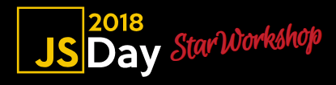

# JSDay 2018 - StarWorkshop



https://jsdaycanarias.com/

## Starting

```bash
git clone https://github.com/ManzDev/starworkshop-jsday
cd starworkshop-jsday
rm -rf .git
npm install
```

## Developing

| Command | Description |
|---------|-------------|
| `npm run dev`    | Delete `dist` folder and open a development web. |
| `npm run build`  | Delete `build` folder and create production web. |
| `npm run deploy` | Deploy `build` folder on `gh-pages` branch (site). |

## Help!

URL Slides: *Coming Soon*

## Collaborations & great demos

*Coming Soon*

## Requisites

- VSCode https://code.visualstudio.com/
- Git https://git-scm.com/
- NodeJS/NPM https://nodejs.org/en/
- Inkscape https://inkscape.org/
